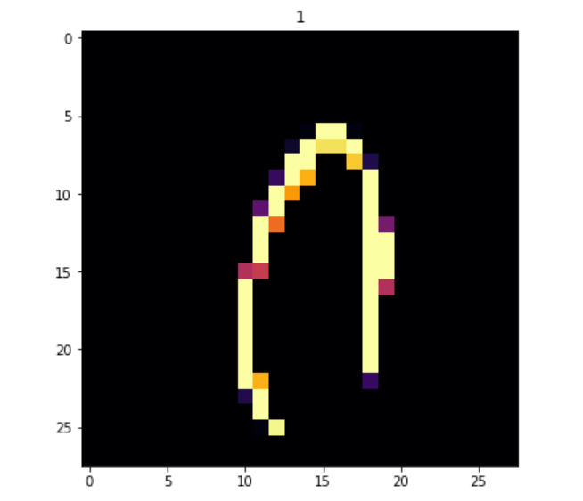
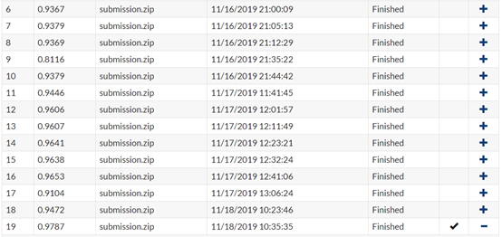

# `Kannada_MNIST`

> `KAGGLE-KANNADA-OPEN-COMPETITION`
>
> `<https://www.kaggle.com/higgstachyon/kannada-mnist>`

## Introduction

> Here, we disseminate a new handwritten digits-dataset, termed `Kannada-MNIST`, for the Kannada script, that can potentially serve as a direct drop-in replacement for the original `MNIST` dataset. In addition to this dataset, we disseminate an additional real world handwritten dataset (with images), which we term as the `Dig-MNIST` dataset that can serve as an out-of-domain test dataset. We also duly open source all the code as well as the raw scanned images along with the scanner settings so that researchers who want to try out different signal processing pipelines can perform end-to-end comparisons. We provide high level morphological comparisons with the `MNIST` dataset and provide baselines accuracies for the dataset disseminated. The initial baselines obtained using an oft-used CNN architecture ( for the main test-set and for the Dig-`MNIST` test-set) indicate that these datasets do provide a sterner challenge with regards to `generalizability` than `MNIST` or the `KMNIST` datasets. We also hope this dissemination will spur the creation of similar datasets for all the languages that use different symbols for the numeral digits.
>
> [REFERENCE ON THE COMPETITION WEB-PAGE]


## WHAT I HAVE DONE

- test different model on this dataset
- build a high-score CNN-NET model which owns a high-accuracy on this data-set.


## XGBOOST

```
# Author By Gary1111

import pandas as pd
import xgboost as xgb
from pandas import DataFrame

train = pd.read_csv("train_XY.csv", index_col=False)
test = pd.read_csv('test.csv', index_col=False)
test.rename(columns={"Unnamed: 0": 'id'}, inplace=True)
test['id'] = list(range(1, 10001))
train_x = train.drop(['id', 'label'], axis=1)  # 得到训练特征
train_y = train['label']
print(train_x.shape, train_y.shape)
print(train_x.columns)
print(train_y)

res = DataFrame()
res['id'] = test['id']
test.drop('id', axis=1, inplace=True)

clf = xgb.XGBClassifier(learning_rate=0.01,
                        n_estimators=100,
                        max_depth=4,
                        min_child_weight=6,
                        gamma=0,
                        subsample=0.8,
                        colsample_bytree=0.8,
                        reg_alpha=0.005,
                        objective='multiclass',
                        nthread=4,
                        scale_pos_weight=1,
                        seed=27)
clf.fit(train_x, train_y, eval_set=[(train_x, train_y)], early_stopping_rounds=100)
res['label'] = clf.predict(test)
print(res.head(5))
res.to_csv("submission.csv", index=False)
```

- Decision tree performs not so well. 
- I think this is caused by the model would recognize every pixel as a feature on a single example. Then it have to use 28*28 features to determine the class of one image. Actually, for most all the time, a image could not be decouple like this.

## DEEP-CNN

```
# Author By Gary1111

import numpy as np
import pandas as pd
from keras import Sequential
from keras.layers import Conv2D, MaxPooling2D, Dropout, Flatten, Dense

```

#### `Load Dataset and print the shape of dataframe`

```
train = pd.read_csv("../data/DataPre/train_XY.csv", index_col=False)
test = pd.read_csv('../data/DataPre/test.csv', index_col=False)
test.rename(columns={"Unnamed: 0": 'id'}, inplace=True)
test['id'] = list(range(1, 10001))
train_x = train.drop(['id', 'label'], axis=1)  # 得到训练特征
train_y = train['label']  # 得到训练标签
test_x = test.drop('id', axis=1)

test_x = test_x / 255
train_x = train_x / 255
train_y = train_y.to_numpy()
train_feature = train_x.to_numpy().reshape((-1, 28, 28, 1))
test_feature = test_x.to_numpy().reshape((-1, 28, 28, 1))
print(train_feature.shape, test_feature.shape)
```

##### *output*

```
(60000, 28, 28) (10000, 28, 28)
```

#### `show the picture`

```
plt.figure(figsize=(6,6))
plt.imshow(train_feature[1],cmap='inferno')
plt.title(train_y[1])
```

##### *output*



##### *It looks like a zero but actually it's an one*

### `Show the net of CNN model`

##### Based on Le-Net model


```

# Initialising the ANN
classifier = Sequential()

# Adding the input layer and the first hidden layer
classifier.add(Conv2D(16, (3, 3), input_shape=(28, 28), activation='relu'))

classifier.add(Conv2D(32, kernel_size=3, padding="same", activation='relu'))
classifier.add(MaxPooling2D(pool_size=(2, 2)))
classifier.add(Dropout(0.25))

classifier.add(Conv2D(64, kernel_size=3, padding="same", activation='relu'))
classifier.add(MaxPooling2D(pool_size=(2, 2)))
classifier.add(Dropout(0.25))

classifier.add(Conv2D(128, kernel_size=3, padding="same", activation='relu'))
classifier.add(MaxPooling2D(pool_size=(2, 2)))
classifier.add(Dropout(0.25))

classifier.add(Conv2D(256, kernel_size=3, padding="same", activation='relu'))
classifier.add(MaxPooling2D(pool_size=(2, 2)))
classifier.add(Dropout(0.25))

classifier.add(Flatten())
classifier.add(Dense(256, activation='relu'))
classifier.add(Dropout(0.5))
classifier.add(Dense(10, activation='softmax'))

classifier.summary()
```

##### *OUTPUT*

```
# Initialising the ANN
classifier = Sequential()

# Adding the input layer and the first hidden layer
classifier.add(Conv2D(16, (3, 3), input_shape=(28, 28, 1), activation='relu'))

classifier.add(Conv2D(32, kernel_size=3, padding="same", activation='relu'))
classifier.add(MaxPooling2D(pool_size=(2, 2)))
classifier.add(Dropout(0.25))

classifier.add(Conv2D(64, kernel_size=3, padding="same", activation='relu'))
classifier.add(MaxPooling2D(pool_size=(2, 2)))
classifier.add(Dropout(0.25))

classifier.add(Conv2D(128, kernel_size=3, padding="same", activation='relu'))
classifier.add(MaxPooling2D(pool_size=(2, 2)))
classifier.add(Dropout(0.25))

classifier.add(Conv2D(256, kernel_size=3, padding="same", activation='relu'))
classifier.add(MaxPooling2D(pool_size=(2, 2)))
classifier.add(Dropout(0.25))

classifier.add(Flatten())
classifier.add(Dense(256, activation='relu'))
classifier.add(Dropout(0.5))
classifier.add(Dense(10, activation='softmax'))

classifier.summary()
```

##### *output*

```
Layer (type)                 Output Shape              Param #   
=================================================================
conv2d_21 (Conv2D)           (None, 26, 26, 16)        160       
_________________________________________________________________
conv2d_22 (Conv2D)           (None, 26, 26, 32)        4640      
_________________________________________________________________
max_pooling2d_17 (MaxPooling (None, 13, 13, 32)        0         
_________________________________________________________________
dropout_21 (Dropout)         (None, 13, 13, 32)        0         
_________________________________________________________________
conv2d_23 (Conv2D)           (None, 13, 13, 64)        18496     
_________________________________________________________________
max_pooling2d_18 (MaxPooling (None, 6, 6, 64)          0         
_________________________________________________________________
dropout_22 (Dropout)         (None, 6, 6, 64)          0         
_________________________________________________________________
conv2d_24 (Conv2D)           (None, 6, 6, 128)         73856     
_________________________________________________________________
max_pooling2d_19 (MaxPooling (None, 3, 3, 128)         0         
_________________________________________________________________
dropout_23 (Dropout)         (None, 3, 3, 128)         0         
_________________________________________________________________
conv2d_25 (Conv2D)           (None, 3, 3, 256)         295168    
_________________________________________________________________
max_pooling2d_20 (MaxPooling (None, 1, 1, 256)         0         
_________________________________________________________________
dropout_24 (Dropout)         (None, 1, 1, 256)         0         
_________________________________________________________________
flatten_5 (Flatten)          (None, 256)               0         
_________________________________________________________________
dense_9 (Dense)              (None, 256)               65792     
_________________________________________________________________
dropout_25 (Dropout)         (None, 256)               0         
_________________________________________________________________
dense_10 (Dense)             (None, 10)                2570      
=================================================================
Total params: 460,682
Trainable params: 460,682
Non-trainable params: 0
```

### `COMPILE and Training`

```
# Compiling the ANN
classifier.compile(loss='sparse_categorical_crossentropy', optimizer="Adam", metrics=['accuracy'])

# Fitting the ANN to the Training set
classifier.fit(train_feature, train_y, batch_size=128, epochs=10)

```

#### *OUTPUT*


### `Result and Conclusion`

#### `Result`



#### `Conclusion`

```
The model performed well on train & validation dataset with no signs of overfitting. This model gives 97% classification accuracy on test dataset. Overall CNN model performace is great on Kannada_MNIST dataset.
```

